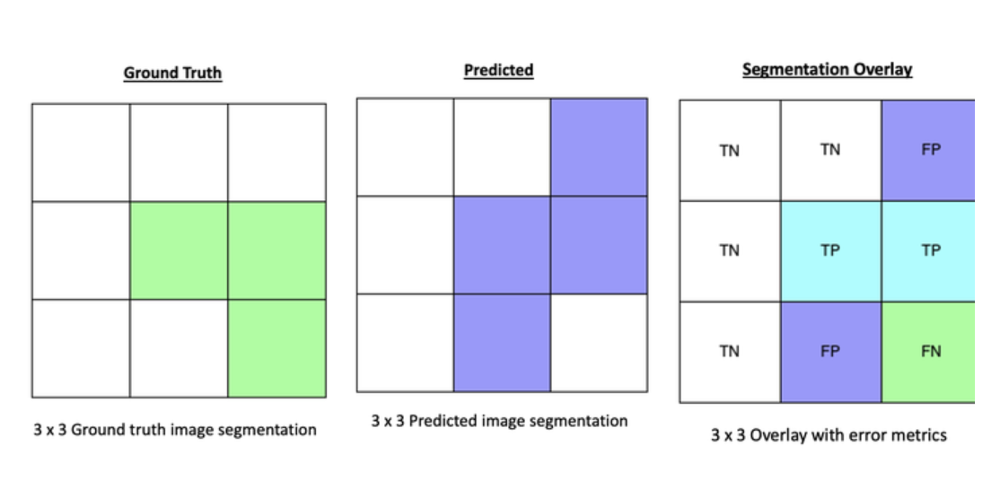
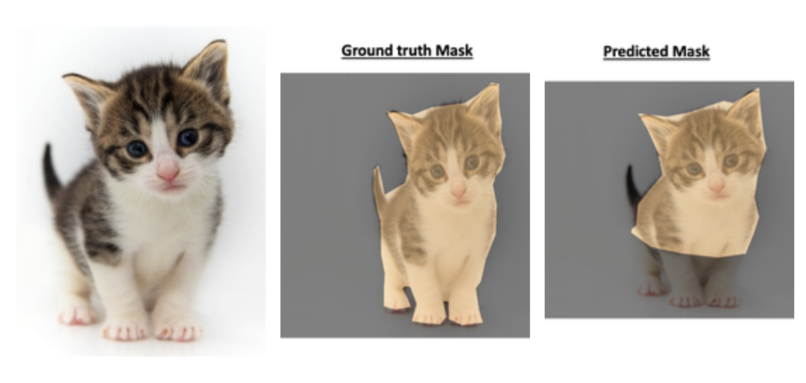

# Evaluation Metrics for Image Segmentation

The evaluation of image segmentation task is similar to a classification problem. We do a truth comparison between ground truth segmentation and predicted segmentation. Here are some of the common evaluation metrics and implementations. Please note that Image segmentation task require tedious evaluation metrics like "Hausdorff distance", "Surface distance", "dice score". Currently, this repo supports some common classification metrics and then build "Dice Score".

Unlike classification problem with numbers, images points towards the pixel values to determine the truth. Here are the definitions of truth valuations with respect to images:

**True Positive:**
The number of pixels that are predicted right with respect to ground truth.

**False Positive:**
The number of pixels that are predicted as a category when there is no mask in ground truth.

**Flase Negative:**
The number of pixels that are not predicted as a category although there is a mask in ground truth maks.

**True Negative:**
The number of pixels that are predicted correctly as empty mask with respect to ground truth mask.

Here are the images to illustrate the above definitions with a 3 x 3 image:



---

The `evaluate.py` file has the class `EvaluateImageSegmentation` with the methods to determine 

`accuracy` <br/>
`precision` <br/>
`recall` <br/>
`f1score` <br/>
`dice` <br/>

Please note that the f1score and dice score are same. Either one works.

A test to check these metrics can be found in  `test.py` script. The testing is done by taking an image and annotating the ground truth and a prediction mask for cat. 



Here are the evaluation metrics:

```
Accuracy: 0.9343
Precision: 0.9718
Recall: 0.7469
F1 Score: 0.8446
Dice: 0.8446

Confusion Matrix: 
predicted      False    True
ground truth                
False         855684    5874
True           68492  202150
```

Note that the Accuracy, precision seems to be high and could be misleading that predictions are better. However, dice score computes the harmonic mean of precision and recall and provide a better understanding of the predicted segmentation.

**Complimentary:** <br/>
Run `extractMasks.py` to extract binary masks from VGG annotated segmentations using VGG Image Annotator(VIA). For more information about VIA, visit: https://www.robots.ox.ac.uk/~vgg/software/via/
